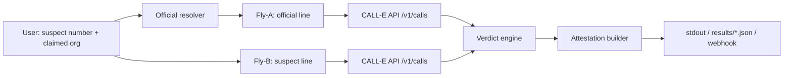

# Scam Mirror — Technical Design

## 1. Architecture



The runtime is a single Python entrypoint,
`skills/scam-mirror/scripts/run_dual_fly.py`, using only the standard library.
Dry-run is the default and never dials. Live mode calls the CALL-E Developer API
directly over HTTPS.

## 2. Components

- `scripts/run_dual_fly.py` — argument parsing, orchestration, output.
- Whitelist resolver — loads `orgs.whitelist.json`, matches the claimed org by
  name or alias, picks the official number for the region.
- CALL-E client — drives the `@call-e/cli` plan/start/status flow, or the REST
  `/v1/calls` API with `--backend rest`.
- Verdict engine — normalization, red-flag detection, and rule-based
  disposition.
- Attestation builder — hashes content, assembles the required JSON schema.
- Persona registry — loads `flies.registry.json`, grounding each fly in a real
  Male CNS connectome neuron (`body_id`, cell type, `vfb_id`).

## 3. CALL-E integration

The live CLI backend (`--backend cli`) uses the official `@call-e/cli` plan →
run → status workflow over the MCP endpoint. A Developer API path
(`--backend rest`) and the SDKs are documented for portability.

### 3.0 CLI (`--backend cli`, default for `--live`)

The CLI is pinned in `skills/scam-mirror/scripts/package.json` and drives the
three MCP tools:

| Command | MCP tool | Effect |
| --- | --- | --- |
| `calle call plan --to-phone X --goal "..."` | `plan_call` | Build a plan; no call. Returns `plan_id` + `confirm_token`. |
| `calle call start --to-phone X --goal "..."` | `plan_call` + `run_call` | Plan and start a real call; returns `run_id` + status. |
| `calle call status --run-id Y` | `get_call_run` | Poll progress until a terminal status. |

Terminal statuses are `COMPLETED`, `FAILED`, `NO_ANSWER`, `DECLINED`,
`CANCELED`, `CANCELLED`, `VOICEMAIL`, `BUSY`, and `EXPIRED`. Authentication is
browser OAuth (`calle auth login`); no API key is needed for the CLI path. The
CLI does not accept a result schema, so `confirmed_business` and `red_flags`
are derived from the returned summary and transcript.

### 3.1 REST API (`--backend rest`)

Credentials:

```bash
export CALLE_API_KEY="iams_live_example"
export CALLE_BASE_URL="https://api.heycall-e.com"
```

Endpoints:

| Method | Path | Purpose |
| --- | --- | --- |
| `POST` | `/v1/calls` | Create a one-recipient call task. |
| `GET` | `/v1/calls/{call_id}` | Read status, summary, structured result, transcript. |
| `GET` | `/v1/calls/{call_id}/events` | List developer-facing call events. |
| `POST` | `/calle/webhook` | Receive terminal call-result webhooks. |

Create payload (abbreviated):

```json
{
  "task": "Call <official> and ask whether <org> runs a callback-verification flow.",
  "recipients": [
    { "phones": ["+18005550100"], "region": "US", "locale": "en-US" }
  ],
  "recipient_result_schema": {
    "type": "object",
    "required": ["reached", "summary", "confirmed_business"],
    "properties": {
      "reached": { "type": "boolean" },
      "summary": { "type": "string" },
      "confirmed_business": { "type": "string", "enum": ["yes", "no", "unknown"] }
    }
  },
  "metadata": { "workflow": "scam-mirror-dual-fly" }
}
```

The CLI polls until `status` is one of `completed | failed | cancelled`. Live
parsing is best-effort and should be re-validated against
<https://docs.heycall-e.com/#/api-reference>.

### 3.2 MCP (alternative)

CALL-E exposes a Streamable HTTP MCP endpoint. The three tools map cleanly onto
the dual-fly flow:

| Tool | Role in Scam Mirror |
| --- | --- |
| `plan_call` | Build each fly's plan without dialing; returns `plan_id` + `confirm_token`. |
| `run_call` | Start a fly after intent is confirmed. |
| `get_call_run` | Poll run status, activity, summary, and transcript. |

MCP `run_call` does not accept a `webhook_url`, so MCP clients poll
`get_call_run`. For the CLI we use the REST API because it supports webhooks and
is simpler to run headless.

### 3.3 SDK (alternative)

- Python: `pip install calle-ai`
- TypeScript: `pnpm add @call-e/calle`

```ts
import { CalleClient } from "@call-e/calle";
const client = new CalleClient({ apiKey: process.env.CALLE_API_KEY! });
const call = await client.calls.createAndWait({
  task: "Call +18005550100 and confirm whether this callback flow exists.",
});
console.log(call.status, call.taskCompleted);
```

## 4. Dual-fly orchestration

1. Resolve `official_number` from the whitelist (or `--official`).
2. Run Fly-A with `OFFICIAL_FLY_SCHEMA`; run Fly-B with `SUSPECT_FLY_SCHEMA`.
3. Each fly returns `reached`, `summary`, and either `confirmed_business`
   (official) or `red_flags` (suspect).
4. Compute `content_hash = sha256(full transcript text)` for each fly. The
   transcript is discarded from the output; only the hash and summary are kept.

## 5. Verdict engine

Number normalization strips non-digits and a leading `00`. Equivalence checks
exact digit equality and, for numbers of 8+ digits, a shared trailing 8 digits.

Red-flag detection scans the transcript and structured result for keyword
groups. Each group maps to a stable flag id:

| Flag id | Detected behavior |
| --- | --- |
| `asks_for_otp` | one-time code / verification code |
| `asks_for_password` | password / PIN |
| `asks_for_transfer` | immediate transfer / wire |
| `asks_for_remote_access` | remote desktop / screen share |
| `asks_for_crypto` | cryptocurrency |
| `demands_secrecy` | "don't tell your family / authorities" |
| `threatens_arrest` | arrest / freeze / prosecutor |
| `asks_to_install_app` | install or download an app |

The keyword lists are English-only so the skill passes the
`awesome-phone-call-agents` repository validation, which requires English-only
repository-facing content. Multilingual detection (for example Chinese scam
scripts) is a clean extension point: load per-locale keyword files at runtime
instead of hardcoding non-English fragments in the repo.

Disposition order:

1. `numbers_equivalent(suspect, official)` → `likely_legit` (0.90).
2. Any `red_flags` → `likely_scam`
   (`min(0.95, 0.55 + 0.14 * len(red_flags))`).
3. Official `confirmed_business == "no"` and suspect reached → `likely_scam`
   (0.78).
4. Neither fly reached → `inconclusive` (0.25).
5. Otherwise → `inconclusive` (0.45).

The LLM summary comparison is an extension point: when enabled, it re-ranks
conflicting summaries, but the rules above remain the deterministic floor.

## 6. Attestation and hashing

The attestation matches the schema in `PRD.md` section 9. `verdict_hash` is
`sha256` over the canonical JSON of `{case_id, suspect_number, official_number,
verdict, official_hash, suspect_hash}` with sorted keys, so the same inputs
reproduce the same hash.

## 7. Configuration

- `.env.example` — `CALLE_API_KEY`, `CALLE_BASE_URL`, optional `OPENAI_API_KEY`.
- `orgs.whitelist.json` — organization names, aliases, and official numbers per
  region. Shipped numbers are fictional `555-01xx` placeholders.
- `results/` — attestation output; live outputs are gitignored except the
  example fixture.

## 8. Safety implementation

- Dry-run is the default; `--live` is an explicit opt-in that prints a side
  effect warning.
- Both fly tasks instruct CALL-E to hang up on secret requests and to provide no
  personal information.
- The skill's `references/safety.md` carries the full contract (intent, E.164,
  masking, no credentials, no recurring schedules, no duplicate jobs,
  cancellation, content boundaries).

## 9. Error handling

- Missing `CALLE_API_KEY` in `--live` → exit code 2 with a clear message.
- Unknown org and no `--official` → exit code 2.
- CALL-E create response without a call id → `RuntimeError`.
- Poll timeout after ~9 minutes → `TimeoutError`.

## 10. Testing

- Dry-run fixtures exercise the full verdict and attestation path with zero
  network.
- `normalize_number`, `numbers_equivalent`, and `detect_red_flags` are pure
  functions and can be unit-tested.
- Live mode is a smoke path behind `--live`; it must not run in CI by default.

## 11. Extension points

- **LLM compare**: use the two summaries to resolve conflicting evidence.
- **Webhook**: pass `webhook_url` to `POST /v1/calls` and receive terminal
  results server-side.
- **Rate limiter**: per-official-line cooldown to stay non-harassing.
- **UI**: a small web form that renders the advisory disclaimer prominently.
